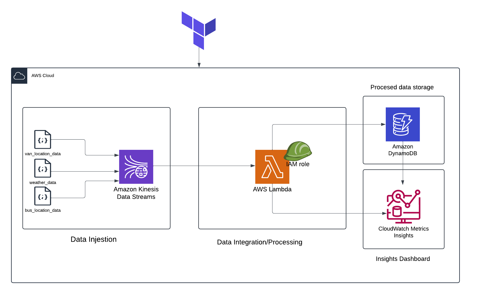

# MDPP (Mini Data Processing Pipeline)

## Overview
MDPP is a real-time data processing pipeline that correlates bus locations with weather data to identify transportation delays caused by adverse weather conditions. The system uses a serverless cloud-native approach to achieve a mini data processing pipeline for real-time data integration and analytics. The solution utilizes Amazon kinesis data streams to ingest mobility data (from the producer; JSON) in real-time. This data is then integrated and processed by AWS Lambda (consumer). The processed data is stored in a stateful NoSql database (Amazon DynamoDB) and insights from the processed data are visible in an Amazon Cloudwatch dashboard.

## Architecture




## Features

- Data quality validation
- Real-time processing of mobility data
- Weather condition monitoring and correlation
- Automated bus delay detection for adverse weather
- Passenger count tracking
- Van service coordination


## Prerequisites
- Python 3.11+
- Terraform v1.9.8
- Create AWS [Account](https://console.aws.amazon.com/) 
- Download and Install [AWS CLI](https://docs.aws.amazon.com/cli/latest/userguide/getting-started-install.html)
- Create an [IAM User](https://us-east-1.console.aws.amazon.com/iam/home?region=us-east-1#/users)
- AWS configure ``` aws configure ```


Libraries used are packaged in ./outputs/processing.zip


## Installation
```bash
# Clone the repository
git clone https://github.com/yourusername/mdpp.git

# Navigate to the project directory
cd mdpp
```

In a terminal opened in ./mdpp directory, initialize the terraform configuration "infra_dpp.tf". This enables Terraform to be able to track changes in the current configuration module.
It initializes a working directory, downloads the necessary provider plugins and modules, and sets up the backend for storing your infrastructure's state.
```bash
terraform init
```
Next, you may want to verify the correctness of Terraform configuration files.
```bash
terraform validate
```
Run 
```bash
terrafrom plan
```
to see an execution plan, This lets you preview the changes that Terraform plans to make to your infrastructure.

It's now time to actually provision the resources. The following command executes planned actions, creating, updating, or deleting infrastructure resources to match the new state outlined in your IaC - infra_dpp.tf

```bash
terraform apply
```

Navigate to the [aws console](https://aws.amazon.com/console/) and sign in with the account credentials you got when you created the account in the Prerequisites section.

In the search bar type in and open aws kinesis, s3, IAM, Lambda, DynamoDB, and Amazon Cloudwatch Dashboard in different tabs. You should find the provisioned resources as described in the main terraform configuration file infra_dpp.tf: 

Kinesis - 3 data streams; bus-location-stream, van-location-stream, weather-stream.

S3 - A bucket named mdpp-lambda-code-bucket is present and has a zipped file, processing.zip, in it containing the library dependencies that enable the Lambda function to run successfully.

IAM - In this tab, navigate to roles on the left-hand pane and click on role. The lambda_role resource is what enables the lambda function seamless interaction with the other AWS services.

Lambda - This is where our data is actually processed using the data_processing.py function.

DynamoDB - A dynamoDB table (insights-table) was created. this stores the results of the processed data for analytics and visualization.

Cloudwatch_Dashboard - takes metrics from the dynamoDB table and displays it in a dashboard.


#
We can push data into our kinesis data streams and let the pipeline handle the rest.
In a CLI opened in ./mdpp, run the following command.
```bash

aws kinesis put-records --stream-name "bus-location-stream"  --cli-input-json file://sample_data/bus_location_data.json --region us-east-1

aws kinesis put-records --stream-name "van-location-stream"  --cli-input-json file://sample_data/van_location_data.json --region us-east-1

aws kinesis put-records --stream-name "weather-stream"  --cli-input-json file://sample_data/weather_data.json --region us-east-1
```
#
If all goes well, you should find the pipeline executed and we have a table of processed data in DynamoDB and some populated metrics in the Cloudwatch dashboard.

This is a work in progress. 
